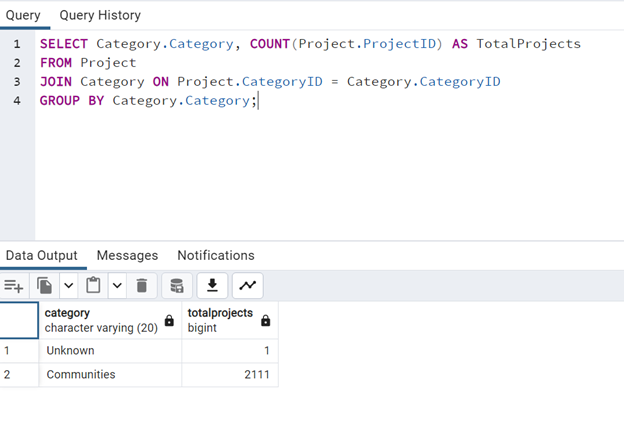
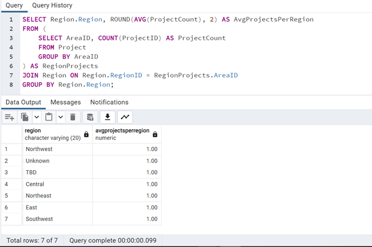
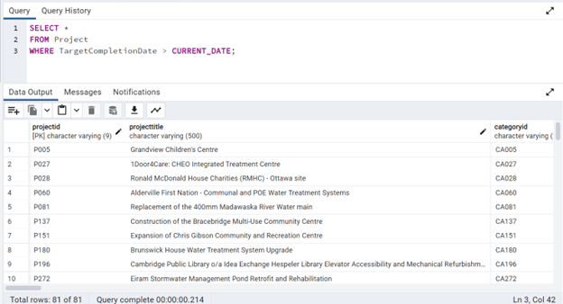
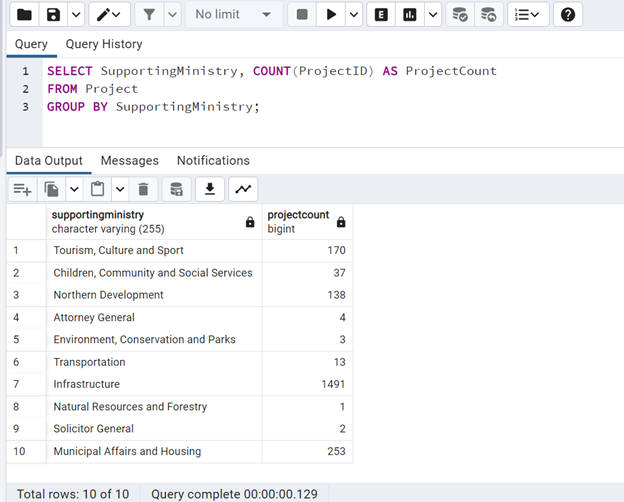
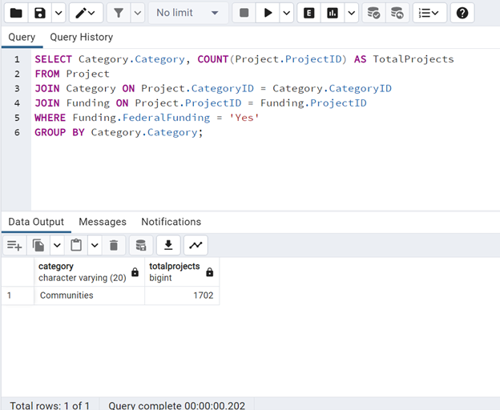
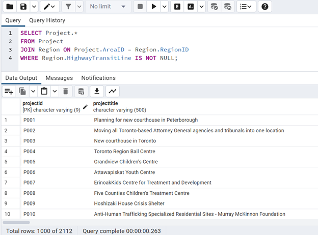
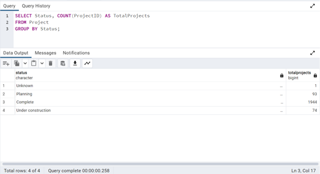
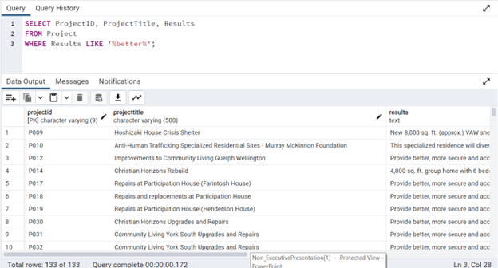
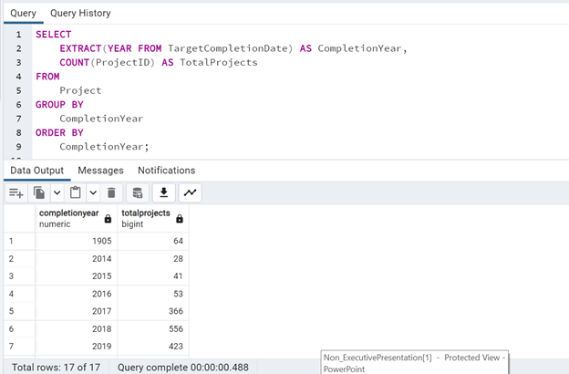

# Analysis Insights

## Query 1: Total Number of Projects

**Insight:** This query provides a breakdown of the total number of projects by category, allowing us to identify the most common project categories.

## Query 2: Average Number of Projects per Region

**Insight:** This query calculates the average number of projects per region, providing insights into the distribution of projects across different regions.

## Query 3: Projects with Target Completion Dates in the Future

**Insight:** This query identifies projects that have target completion dates in the future, indicating ongoing or planned projects.

## Query 4: Number of Projects Supported by Each Ministry

**Insight:** This query provides a count of projects supported by each ministry, helping to understand the distribution of project support across different government departments.

## Query 5: Projects in Each Category with Federal Funding

**Insight:** This query shows the distribution of projects within each category that receive federal funding, highlighting areas where federal support is concentrated.

## Query 6: Projects in Regions with Highway Transit Lines

**Insight:** This query identifies projects located in regions with highway transit lines, which could be relevant for infrastructure or transportation-related projects.

## Query 7: Percentage of Projects Completed

**Insight:** This query calculates the percentage of projects that are marked as completed, providing an overall completion rate for the projects.

## Query 8: Number of projects by Status

**Insight:** Analysis of project count by status provides insights into project progress, resource allocation, and risk assessment, aiding in effective decision-making and performance monitoring.

## Query 9: Projects with Results Containing the Keyword “better”

**Insight:** This query retrieves projects where the results contain a specific keyword called ‘better’, facilitating targeted analysis and evaluation of projects with specific outcomes or objectives. It enables stakeholders to focus on projects relevant to their interests or objectives.

## Query 10: Projects by Year

**Insight:** This query provides a breakdown of the total number of projects completed each year. Analyzing project completion trends over time can help identify patterns and assess the organization's project management performance.

